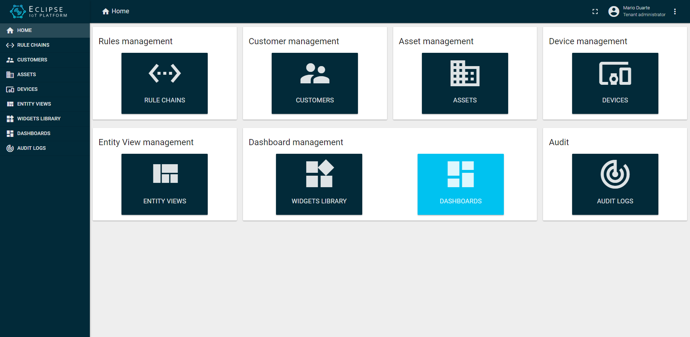

# Eclipse - ThingsBoard Customized UI

Customized UI for ThingsBoard IoT platform.
[](./src/assets/artwork/logo_b.png)

## Running Thingsboard UI

Eclipse UI is forwarding all request at the ThingsBoard demo server by default. To get started, simply run the command bellow.

```
git clone https://github.com/mariojfduarte/eclipse-ui.git

cd eclipse-ui/master

npm install

npm start

```

Using Docker:

```
To build:
docker build -t NAME .


To run:
docker run -d -p 3000:3000 NAME
```


## Screenshots
[**Home screenshot**](./src/assets/artwork/home.png)
[](./src/assets/artwork/home.png)


## ThingsBoard
[](https://gitter.im/thingsboard/chat?utm_source=badge&utm_medium=badge&utm_campaign=pr-badge&utm_content=badge)
[](https://travis-ci.org/thingsboard/thingsboard)

ThingsBoard is an open-source IoT platform for data collection, processing, visualization, and device management.


## Documentation

ThingsBoard documentation is hosted on [thingsboard.io](https://thingsboard.io/docs).

## Getting Started with Thingsboard

Collect and Visualize your IoT data in minutes by following this [guide](https://thingsboard.io/docs/getting-started-guides/helloworld/).

## Support

 - [Community chat](https://gitter.im/thingsboard/chat)
 - [Q&A forum](https://groups.google.com/forum/#!forum/thingsboard)
 - [Stackoverflow](http://stackoverflow.com/questions/tagged/thingsboard)

## Licenses

This project is released under [Apache 2.0 License](./LICENSE).
